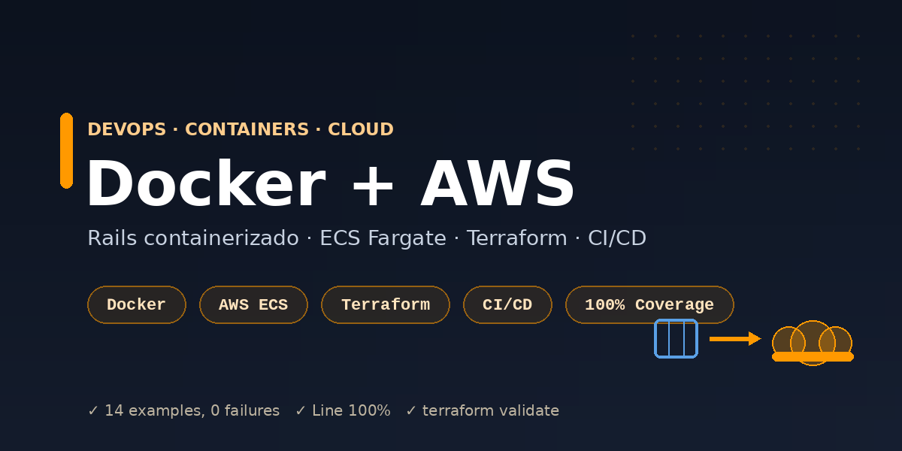

<p align="center">
  
</p>

<h1 align="center">Rails + Docker + AWS (DevOps)</h1>

<p align="center">
  Uma API Rails <strong>containerizada com Docker</strong> e pronta para <strong>deploy na AWS</strong>
  (ECS Fargate), com <strong>infraestrutura como código (Terraform)</strong> e um pipeline de
  <strong>CI/CD</strong> que builda a imagem e publica nos registries.
</p>

<p align="center">
  <a href="https://github.com/Dudainfinity/rails-docker-aws/actions/workflows/ci-cd.yml">
    
  </a>
  
  
  
  
  
</p>

---

## O que demonstra

- **Containerização**: imagem **multi-stage** de produção (build enxuto, usuário não-root, jemalloc) e **`docker-compose`** para subir a stack (web + PostgreSQL) localmente.
- **Deploy na AWS**: a app roda em **ECS Fargate** atrás de um **ALB**, com **RDS PostgreSQL** e logs no **CloudWatch**.
- **Infra como código (Terraform)**: todo o ambiente — ECR, ECS, ALB, RDS, IAM, Security Groups — versionado em [`deploy/terraform/`](deploy/terraform) e validado no CI (`terraform validate`).
- **CI/CD**: testes + cobertura, RuboCop, Brakeman, validação do Terraform, build/push da imagem (GHCR) e um **deploy real para ECR + ECS** (via OIDC, ativável por *flag*).
- **App testada**: API de notas com **100% de cobertura** (RSpec) e health check `/up` usado pelo ALB.

## Arquitetura na AWS

```
              Internet
                 │
                 ▼
        ┌──────────────────┐
        │  ALB (HTTP :80)  │  health check → /up
        └────────┬─────────┘
                 ▼
     ┌────────────────────────┐        ┌──────────────────┐
     │  ECS Fargate (N tasks) │ ─────▶ │  RDS PostgreSQL  │
     │  imagem do ECR         │        └──────────────────┘
     └───────────┬────────────┘
                 ▼
           CloudWatch Logs
```

## Rodando com Docker (local)

```bash
docker compose up --build
docker compose run --rm web bin/rails db:prepare
# API em http://localhost:3000  (ex.: GET /api/v1/notes)
```

## Provisionando a AWS com Terraform

```bash
cd deploy/terraform
terraform init
terraform plan  -var="rails_master_key=$(cat ../../config/master.key)" -var="db_password=<senha-forte>"
terraform apply -var="rails_master_key=$(cat ../../config/master.key)" -var="db_password=<senha-forte>"

terraform output alb_dns_name        # URL pública da aplicação
terraform output ecr_repository_url  # repositório para enviar a imagem
```

Recursos criados: **ECR**, **ECS Cluster + Service + Task Definition (Fargate)**, **ALB +
Target Group + Listener**, **RDS PostgreSQL**, **IAM** (execution role), **Security Groups**
e **CloudWatch Log Group**. Usa o *default VPC* para ser autossuficiente.

> **Produção**: `rails_master_key` e `db_password` estão como variáveis sensíveis por
> simplicidade. Em produção, prefira **SSM Parameter Store / Secrets Manager** (o
> [`deploy/ecs-task-definition.json`](deploy/ecs-task-definition.json) já referencia `secrets` via SSM).

## Pipeline CI/CD

[`.github/workflows/ci-cd.yml`](.github/workflows/ci-cd.yml) — em push/PR para `main`:

| Estágio | Job | O que faz |
|---|---|---|
| CI | `test` | RSpec + cobertura (PostgreSQL) |
| CI | `lint` | RuboCop |
| CI | `security` | Brakeman |
| CI | `iac` | **`terraform fmt` + `validate`** da infra |
| CD | `build-and-push` | Builda e publica a imagem no **GHCR** |
| CD | `deploy-aws` | **Deploy real para ECR + ECS Fargate** (OIDC) — *gated* |

O job **`deploy-aws`** fica **desativado por padrão** e só roda quando a variável de repo
`AWS_DEPLOY` for `true` e os segredos de AWS estiverem configurados:

| Segredo / Variável | Uso |
|---|---|
| `AWS_DEPLOY_ROLE_ARN` (secret) | Role assumida via **OIDC** (sem chaves estáticas) |
| `AWS_DEPLOY` (variable = `true`) | Liga o deploy |
| `AWS_REGION` (variable) | Região (padrão `us-east-1`) |

Fluxo do deploy: **build → push para ECR → render da task definition com a nova imagem →
`ecs deploy` com espera de estabilidade**. Sem AWS configurada, o restante do pipeline
(testes, lint, segurança, IaC, imagem no GHCR) roda verde normalmente.

```bash
docker pull ghcr.io/dudainfinity/rails-docker-aws:latest
```

## Testes

```bash
bundle exec rspec
```

```
14 examples, 0 failures
Line Coverage:   100.0%
Branch Coverage: 100.0%
```

## Licença

Distribuído sob a licença MIT. Veja [`LICENSE`](LICENSE).
